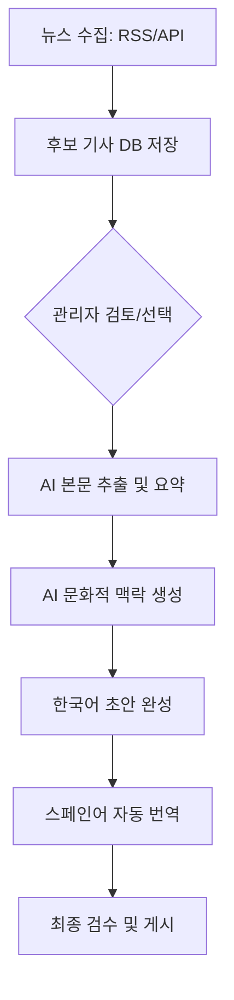

# 📌 프로젝트 기획서: Corea Hoy (코리아 오이)

> **AI 기반 한국 뉴스 큐레이션 및 문화 해설 플랫폼**  
> 중남미 스페인어권 사용자들을 위한 "가장 쉽고 친절한 한국 소식통"

---

## 📋 1. 프로젝트 개요

| 항목 | 내용 |
| :--- | :--- |
| **서비스명** | **Corea Hoy** (스페인어로 '오늘의 한국' 의미) |
| **타겟 사용자** | 한국 문화와 뉴스에 관심이 많은 중남미 스페인어권 사용자 |
| **핵심 문제** | 영어/한국어 중심의 정보 편중, 단순 번역으로 인한 문화적 맥락 이해의 어려움 |
| **해결 책** | AI를 활용한 뉴스 요약 + 문화적 맥락(Context) 추가 + 스페인어 특화 콘텐츠 |
| **한 줄 요약** | AI로 재구성한 한국 뉴스를 문화 설명과 함께 전달하는 글로벌 콘텐츠 플랫폼 |

---

## 🔍 2. 문제 정의 및 해결 방안

### ❗ 우리가 발견한 페인 포인트 (Pain Points)
1. **언어 장벽**: 대부분의 고품질 한국 정보가 한국어나 영어로만 제공됨.
2. **이해의 한계**: 단순 번역본은 한국 특유의 문화적 배경지식이 없으면 이해하기 어려움.
3. **정보 과부하**: 기성 뉴스는 내용이 너무 길고 모바일에서 소비하기에 무거움.

### 💡 Corea Hoy의 해결책
1. **AI 큐레이션**: RSS 및 API를 통해 수집된 뉴스를 AI가 핵심 위주로 짧고 쉽게 재구성.
2. **문화적 맥락(Context) 제공**: 뉴스 본문 외에 관련 한국 문화 설명을 추가하여 이해도 증진.
3. **모바일 최적화**: 가볍고 빠른 UI/UX를 통해 중남미의 다양한 네트워크 환경 대응.

---

## 🎯 3. 타겟 사용자 및 페르소나

### 주요 타겟
* **연령**: 10~35세 (Z세대 및 밀레니얼 중심)
* **관심사**: K-POP, K-드라마, 한국 음식, 한국어 학습
* **특징**: 모바일 소셜 미디어를 통한 정보 소비가 활발함

### 사용자 페르소나: Maria (22세, 멕시코 대학생)
* **상황**: 한국 드라마를 좋아하게 되어 한국 트렌드를 실시간으로 알고 싶어 함.
* **니즈**: 한국의 최신 유행이나 사회적 현상을 스페인어로 쉽고 빠르게 파악하고 싶음.
* **고충**: 검색하면 나오는 정보들이 너무 전문적이거나, 기계 번역이라 의미가 모호함.

---

## ✨ 4. 핵심 기능 (MVP)

### ✅ 필수 구현 기능 (Must Have)
* **다국어 시스템**: 전역 상태 관리를 통한 한국어/스페인어 즉시 전환.
* **콘텐츠 파이프라인**: [뉴스 수집 → AI 요약 → 문화 설명 생성 → 스페인어 번역] 자동화 구조.
* **카테고리 필터링**: K-POP, 드라마, 뉴스, 문화, 스포츠, 음식 등 관심사별 탐색.
* **관리자 대시보드**: AI가 생성한 콘텐츠를 검수하고 게시하는 운영 툴.
* **구글 소셜 로그인**: 간편한 회원가입 및 사용자 활동 기록.

---

## ⚙️ 5. 콘텐츠 생성 파이프라인

Corea Hoy의 핵심 가치는 **"검수된 AI 콘텐츠"**입니다.

---

## 📱 6. 화면 설계 (Information Architecture)

| 화면명 | 주요 기능 및 구성 요소 |
| :--- | :--- |
| **메인 (Home)** | 카테고리 필터, 최신 콘텐츠 그리드 레이아웃, 검색바 |
| **상세 (Detail)** | 고해상도 이미지, 요약/본문, **문화 설명 섹션**, 원문 출처 링크, 댓글/좋아요 |
| **로그인 (Login)** | 구글 소셜 로그인 연동, 이용 약관 안내 |
| **마이페이지** | 프로필 수정, 내가 좋아요 한 콘텐츠 리스트, 내 댓글 관리 |
| **관리자 (Admin)** | 후보 기사 대시보드, AI 편집기, 번역기, 미리보기 모드 |

---

## 🛠️ 7. 기술 스택 (Tech Stack)

| 구분 | 기술 | 상세 이유 |
| :--- | :--- | :--- |
| **Frontend** | **Next.js (App Router)** | SEO 최적화 및 빠른 페이지 로딩 (중남미 타겟팅 필수) |
| **State** | **React Context API** | 전역 언어 설정(ko/es) 관리 최적화 |
| **Database** | **PostgreSQL** | 구조화된 뉴스 데이터 및 사용자 활동 관리 |
| **AI / NLP** | **GPT-4o / DeepL API** | 고품질 요약 및 자연스러운 스페인어 번역 |
| **Deploy** | **Vercel** | 지속적 통합 및 글로벌 엣지 네트워크 활용 |

---

## 📅 8. 개발 로드맵

1. **1주차 (기획/설계)**: UI/UX 상세 설계, DB 스키마 정의, API 명세서 작성.
2. **2주차 (핵심 개발)**: 콘텐츠 파이프라인 구축, 다국어 시스템 및 메인/상세 페이지 구현.
3. **3주차 (기능 확장)**: 관리자 대시보드 고도화, 소셜 로그인 연동.
4. **4주차 (안정화)**: 데이터 검수, 성능 최적화 및 최종 배포.

---

## 🚀 9. 향후 확장 계획

* **개인화 추천**: 사용자 활동 기반 카테고리 추천 알고리즘 도입.
* **이메일 뉴스레터**: 구독자 대상 주간 베스트 한국 소식 발송.
* **커뮤니티 강화**: 사용자 간 의견을 나눌 수 있는 토론장 및 투표 기능.
* **멀티 플랫폼**: iOS/Android 앱 출시를 통한 접근성 극대화.

---

### 💡 최종 한 줄 정리
> **Corea Hoy는 단순한 번역 서비스를 넘어, AI 기술로 언어와 문화의 간극을 메워 중남미 사람들에게 한국을 가장 가깝게 연결하는 플랫폼이 될 것입니다.**